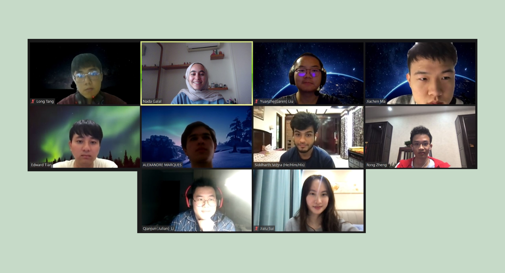

# Welcome To _The Moony Raccoon_'s Home Page!:smiley:

## Team Name: _The Moony Raccoon_
- Moony
  - means forgetful, implies the purpose of our _Bullet Journal_ project for personal organization.
  - relates to nature, implies our team's slogan "[Care for the earth; Care for the comming birth](a "By group member Edward Tian")"
- Raccoon
  - a kind of very-UCSD animal
  - relates to nature
#### Motto:
- [We should consider ourselves engineers that respect the nature and incorporate beauty of the nature in our work.](a "By group member Qianjun Li")

## Team Brand

<!-- <table>
  <tr>
    <td></td>
    <td colspan="2">
Why we designed this brand? blablabla...
</td>
  </tr>
</table> -->
<!-- <table>
  <tr>
    <td></td>
    <td colspan="2">
Why we designed this brand? blablabla...
</td>
  </tr>
</table> -->

## Team Photo

## Team Video

Link to the Youtube Video:

## Team Values
 * We value efficiency because it is is vital in agile software development or even in our fast-paced modern life.
 * We value orderliness because it makes things organized, which enables us to live and work in a comfortable environment.
 * We believe that trust is important in a team. But trust is built upon everyone's actions. We should depend on each other's work to gain trust from teammates.
 * We value connection because, as humans, we survive and develop because of the connection with nature. Connection is necessary for a team project because an individual is limited without the help from the teammates or reference.
 *  We strive to be goal-oriented because goals provide governance to vision and mission and help us stay on track.
 *  We are open to learning. We will take the comments from each other and improve ourelves with each other's valuable opinions.
 *  We are willing to listen to each other, not only about the project but also all other things happening in our lives.
 *  We appreciate one another, and we appreciate each of our ideas and efforts.
 *  We will work with each other and help each other. “Alone we can do so little; together we can do so much.”
 *  We will be committed to the team, build rapport with teammates, and make efforts for the team.
 *  We will be responsible to our team. Complete our tasks on schedule, and to the highest standard.
 
## Roster
|Name & Github Page|Email Address|Summary|
|:--- |:---:|:---|
|**Team Leaders**| | |
|[Nada Galal](https://nadagehad01.github.io/repo/ "github page")|<ngalal@ucsd.edu>|Hi, I'm Nada. I'm a sophomore in ERC majoring in computer science and minoring in design and business. I'm also a CSE tutor and a mentor for 2 hs mentorship programs. That's how much I enjoy teaching!   |
|[Austin Choy](https://github.com/a2choy/Lab1 "github page")|<a2choy@ucsd.edu>| |Hi, my name is Austin Choy from Korea and I am a junior majoring CS at sixth. |
| **Group Members**| | |
|[Yuyang Tian](https://edwardyuyangtian.github.io/ "github page")|<y6tian@ucsd.edu>|I’m Yuyang Tian from China, a second year student double majoring in CS and Math in Warren College.|
|[Long Tang](https://brendon3tang.github.io/CSE-110_Lab_week1/ "github page")|<lotang@ucsd.edu>|I’m Long Tang from Guangzhou, China, a junior and transfer CS student in Warren.|
|[Siddharth Vohra](https://siddvoh.github.io/Github-Pages/ "github page")|<sivohra@ucsd.edu>|I'm Siddharth from Delhi, India. I'm a second year Math-CS student in ERC. |
|[Jiachen Ma](https://stephenmaaa.github.io/CSE110-Lab1/ "github page")|<jma@ucsd.edu>|I’m Jiachen Ma. I’m a third-year CS student in Warren.|
|[Alexandre Marques](https://amarques-ucsd.github.io/ "github page")|<amarques@ucsd.edu>|I'm Alexandre Marques from Portugal. I am a Computer Engineering major sophomore from Warren. |
|[Qianjun Li](https://liqianjun0428.github.io/cs110-lab1/ "github page")|<qil008@ucsd.edu>|I am Qianjun Li, second year CS student from Revelle. |
|[Yuanzhe Liu](https://yuanzhe-liu6.github.io/CSE110-Lab1/ "github page")|<yul156@ucsd.edu>|I’m Yuanzhe from China. I am a CS major sophomore from Sixth College.|
|[Rong Zheng](https://r2zheng.github.io/Github-Pages/ "github page")|<r2zheng@ucsd.edu>|I'm Rong Zheng from China, a 2nd-year CS student in Warren College.|
|[Jialu Sui](https://jialusui.github.io/GitHub-Pages-project/ "github page")|<jisui@ucsd.edu>|I’m Jialu from China. I am a  Math-CS and Cognitive Science junior in Marshall College.|
| **TA Mentor**| | |
|Paarth Neekhara|<pneekhar@eng.ucsd.edu>| |
