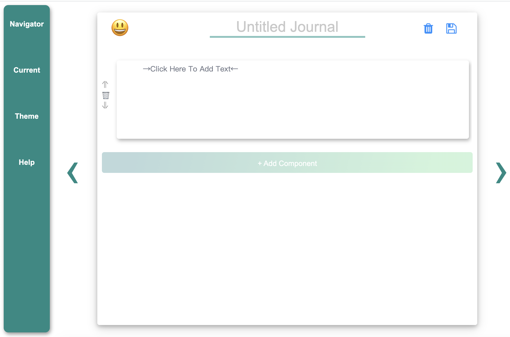

# Group 33 onboard document

## Published Website
You can access our website at [Link to our website](https://cse110-sp21-group33.github.io/cse110-sp21-group33/source/Journal_Draft_v1/)

#### Using the web app:
Click the save button on the top right corner after finish editing the journal of each day. The content of the journal will be reloaded when needed. If it fails to reload, open the browser developer tool -> Application -> Storage -> IndexedDB. You'll see two databases. Delete them and try again.

#### Clone & Set up things locally:
You can use the regular way to clone the repo to your local. If you wish to deploy it, push the repo to your own Github repo and set github pages to deploy. Notice that the index.html is inside /source/Journal_Draft_v1, so make sure the link is correct after the deployment.

## Final project videos

- [Link to our final public video](https://youtu.be/rgyJdM-oMmY)
- [Link to our final private video](https://youtu.be/QFolHQGuQ7M)

## CI/CD pipeline and documentation:
All documents and video about our CI/CD pipeline can be accessed through [this link](https://github.com/cse110-sp21-group33/cse110-sp21-group33/tree/main/admin/cipipeline)

We have 3 checkpoints for the CI/CD pipelines. All information about these 3 checkpoints are in the link above, which is under **admin/cipipeline** in our github repo

## Design

 Design of our team theme and branding can be found at [this link](https://github.com/cse110-sp21-group33/cse110-sp21-group33/tree/main/admin/branding).

 Design of our bullet journal website can be found in **/specs** folder in our github repo.
 * We have 9 architecture decision records(adr), which can be found [here](https://github.com/cse110-sp21-group33/cse110-sp21-group33/tree/main/specs/adrs). These adrs contain all of our important decisions about our bullet journal website.
 * You can find our project pitch [here](https://github.com/cse110-sp21-group33/cse110-sp21-group33/tree/main/specs/pitch). This pitch is in a representation form. It contains our **Statement of purpose**, **identified problems**,**possible risk and rabbit holes**,**5 user personas** who might be our targer users, and the **initial design** of our bullet journal webpage.
 * You can also see the brainstroming of our website at [this link](https://github.com/cse110-sp21-group33/cse110-sp21-group33/tree/main/specs/brainstorm)

## Sprints and Retrospectives
We also have sprint meetings and retrospective meetings to distribute tasks and reflect on our group work and BuJo design.

### Sprint meeting 1:
* We distributed tasks to every group member [here](https://github.com/cse110-sp21-group33/cse110-sp21-group33/blob/main/admin/meetings/051421-meeting.md)
* We hold our retrospective meeting [here](https://github.com/cse110-sp21-group33/cse110-sp21-group33/blob/main/admin/meetings/051821-retrospective.md)
* We reflected on our group work and conclude our sprint meeting [here](https://github.com/cse110-sp21-group33/cse110-sp21-group33/blob/main/admin/meetings/051521-sprint-1-review.md)

### Sprint meeting 2:
* We distributed tasks to every group member [here](https://github.com/cse110-sp21-group33/cse110-sp21-group33/blob/main/admin/meetings/060421-meeting.md)
* We hold our retrospective meeting [here](https://github.com/cse110-sp21-group33/cse110-sp21-group33/blob/main/admin/meetings/053121-retrospective2.md)
* We reflected on our group work and conclude our sprint meeting [here](https://github.com/cse110-sp21-group33/cse110-sp21-group33/blob/main/admin/meetings/052921-sprint-2-review.md)

## Admins
- All the meeting notes [here](https://github.com/cse110-sp21-group33/cse110-sp21-group33/tree/main/admin/meetings)
- The signed contract[here](https://github.com/cse110-sp21-group33/cse110-sp21-group33/tree/main/admin/misc)
- Team branding related things [here](https://github.com/cse110-sp21-group33/cse110-sp21-group33/tree/main/admin/branding)
- CI/CD pipeline documentations [here](https://github.com/cse110-sp21-group33/cse110-sp21-group33/tree/main/admin/cipipeline)
- Team video [here](https://github.com/cse110-sp21-group33/cse110-sp21-group33/tree/main/admin/videos)
 
## Source
[/source](https://github.com/cse110-sp21-group33/cse110-sp21-group33/tree/main/source) folder contains all source code and test code of our bullet journal.
 
- Inside,
 - [/Journal_Draft_v1](https://github.com/cse110-sp21-group33/cse110-sp21-group33/tree/main/source/Journal_Draft_v1) contains our bullet journal source code. Inside there /index.html is the root.
 - [/__test__](https://github.com/cse110-sp21-group33/cse110-sp21-group33/tree/main/source/__test__) contains our testing files including the unit test.
 
## Testing
We mainly focused on the unit test.
 
The [workflows](https://github.com/cse110-sp21-group33/cse110-sp21-group33/tree/main/.github/workflows) checks the coding style, build process, etc.

